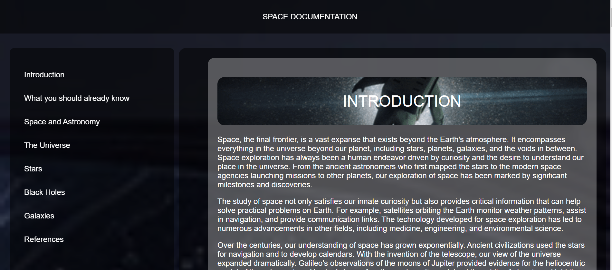

# Space Documentation Page

This is a documentation page about space, covering various topics such as astronomy, the universe, stars, black holes, and galaxies. It serves as an educational resource for understanding the vast expanse beyond Earth's atmosphere.

## Table of Contents

- [Introduction](#Introduction)
- [What You Should Already Know](#What_you_should_already_know)
- [Space and Astronomy](#Space_and_Astronomy)
- [The Universe](#The_Universe)
- [Stars](#Stars)
- [Black Holes](#Black_Holes)
- [Galaxies](#Galaxies)
- [References](#References)

## Sections

Each section of the documentation covers a different aspect of space and astronomy, providing both descriptive text and relevant information. The sections include:

- **Introduction**: An overview of space exploration, its significance, and historical milestones.
- **What You Should Already Know**: Basic background knowledge assumed for understanding the documentation.
- **Space and Astronomy**: Exploration of the study of celestial objects, modern astronomy, and its sub-disciplines.
- **The Universe**: Discussion on the origins, structure, and potential fate of the universe.
- **Stars**: Information about stars, their formation, life cycle, and significance in the cosmos.
- **Black Holes**: Exploration of black holes, their properties, formation, and implications in astrophysics.
- **Galaxies**: Insight into galaxies, their morphology, formation, and role in cosmic evolution.
- **References**: Additional resources for further reading, including links to relevant websites.

## References

At the end of the documentation, there is a section providing links to additional resources for those who want to explore further.

# Demo 

<video controls src="webpage.mp4" title="Title"></video>

## Technologies Used

- HTML
- CSS


## How to Use

1. Clone the repository to your local machine.
```bash 
git clone 
```
2. Open the `index.html` file in a web browser to view the documentation page.
3. Open the file in vsCode or any code editor to see the source code.
3. Navigate through the sections using the navigation bar or by scrolling through the page.

## Author 

- LinkedIn: I was logged out of my LinkedIn account temporiraly for some time. 
- Email: [Zohal Mirkhel] zohalmirkhel@gmail.com
- GitHub: [Zohal Mirkhel] https://github.com/ZohalMirkhel
